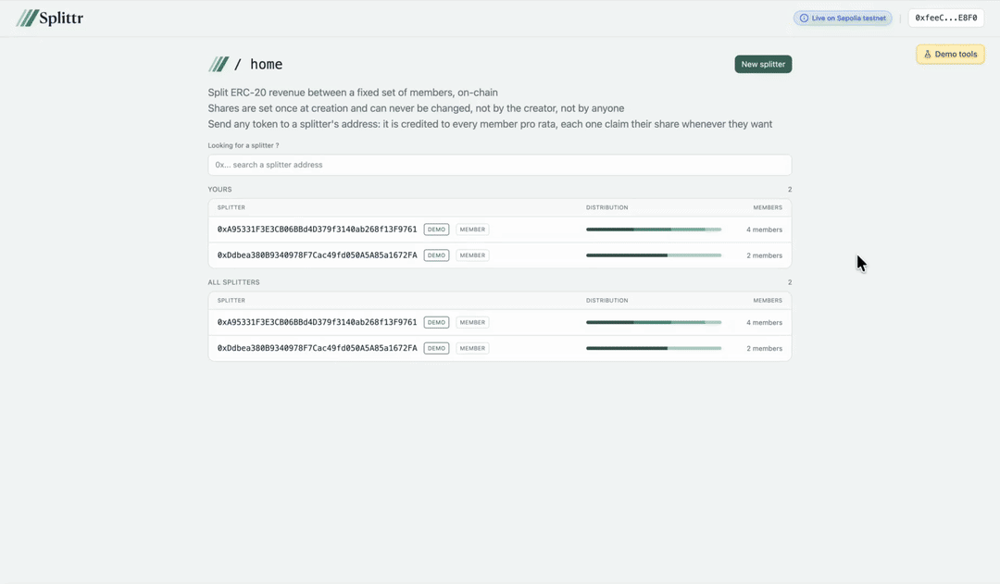

# Revenue splitter — Splittr

An immutable on-chain revenue splitter. A team defines who gets what percentage,
once. Anyone can then send any ERC-20 token to the splitter's address — no
approval, no integration, no awareness that the address is anything special — and
each member withdraws their own share whenever they want.

**[Live demo →](https://revenue-splitter.yannduffo.xyz)** (Sepolia)



---

## Why it's built this way

Two decisions carry the whole system.

**Pull, not push.** The contract never sends money on its own. Paying out to N
members on every incoming transfer would cost unbounded gas, and one recipient
whose address reverts on receive would freeze everyone else's income. Instead, a
deposit only bumps a single global counter — value received *per share* — and each
member holds their own checkpoint on it. What you're owed is the gap between the
counter and your checkpoint, times your shares. Adding a fiftieth member costs a
deposit nothing.

**Deposits are detected by balance difference.** There is no `deposit()` function.
The contract compares its actual token balance against what it has already
attributed, so a plain ERC-20 `transfer` to a splitter executes no code at all.
The money sits there until the next claim absorbs it — correctly and in full,
however many unrecorded deposits piled up. That is what lets a splitter be used as
an ordinary payment address, and it handles fee-on-transfer tokens correctly for
free, since only what actually arrived is ever distributed.

There is no admin, no owner and no escape hatch. The allocation is fixed at
creation and nobody can change it, including the team that created it. Every
recovery path is also a theft path — the absence of one is the point.

## Try it

The live demo runs on Sepolia with two seeded splitters. Both are readable
without a wallet:

- **Splitter A** — two members, one token claimed, one untouched
- **Splitter B** — four members with uneven shares, deposits and claims
  interleaved over time, so everyone sits in a different position

The **Demo tools** panel mints test tokens and lets you send them to a splitter,
if you have a wallet with Sepolia ETH. Every member's balance moves at the next
block, in proportion to their share.

## Repository

```
revenue-splitter/
├── contracts/     Foundry — Solidity, 42 tests, deploy and seed scripts
├── web/           Next.js dApp — wagmi, viem, no indexer
└── IDEAS.md       Deferred scope & futur improvments
```

Each part has its own README: [contracts](./contracts/README.md) for the
accounting model and the test suite, [web](./web/README.md) for the frontend
architecture and its technical trade-offs.

## Deployed on Sepolia

| | Address |
|---|---|
| SplitterFactory | [`0x2A8B…02e0`](https://sepolia.etherscan.io/address/0x2A8B524C1fe5ff0687E642A5611BE907cfe902e0) |
| Splitter implementation | [`0x8371…8cDa`](https://sepolia.etherscan.io/address/0x8371833b4Ac9aff2BEF24B3964015B2C209C8cDa) |
| dEUR (demo token, 18 dec) | [`0x7B67…1a1b`](https://sepolia.etherscan.io/address/0x7B67f6672Da8a852CC82e1322DD1b306B47E1a1b) |
| dUSD (demo token, 6 dec) | [`0x40FA…7c0f`](https://sepolia.etherscan.io/address/0x40FAB6b0998888EcFdd7a13FbEa81718aFfD7c0f) |

All verified.

## Running locally

```bash
# contracts
cd contracts && forge test
anvil                          # terminal 1
make deploy-seed-anvil         # terminal 2

# frontend
cd web && npm install && npm run wagmi && npm run dev
```

Details in each README.

## Known limitations

**No indexer.** The frontend reads everything straight from the chain — event
logs for discovery and history, view calls for balances. At this scale that means
no backend, no database and no extra deployment, but first loads are slow and the
setup would not hold up under real traffic. The data access layer is isolated so
that swapping in an indexer touches three files and nothing else. It is the
change this project most obviously needs next.

**Mobile is read-only.** No WalletConnect connector yet, so browsers without an
injected wallet can browse but not transact.

**Not audited.** This is a portfolio project, not a production protocol.

## Prior art

[0xSplits](https://splits.org/) is the reference implementation of on-chain
payment splitting and has grown into a full platform covering far more ground.
This is a deliberately minimal take on the same core idea: immutable allocations,
pull-based claims, no admin, small enough to read end to end in one sitting.

## Roadmap

- [x] Contracts, tests, deployment and seeding scripts
- [x] Web interface — create, browse, claim, batch claim, activity history
- [x] Sepolia deployment with verified contracts and a live demo
- [ ] v1.1 Indexer — replace direct log queries, fix load times
- [ ] v2: native ETH, mutable allocations with a settlement path, delegated claims, WalletConnect for mobile

## License

MIT
